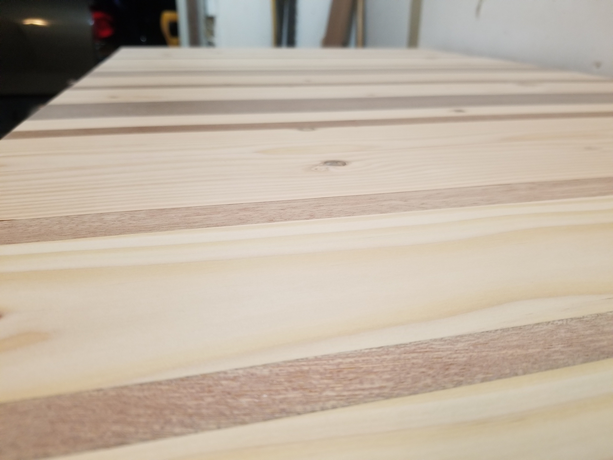

## Finished Product First...

 

## Setup

This whole thing started out of my need to replace my 10-year-old Ikea desk that was falling apart. I had a bunch of these 3' rough sawn beam cut-offs leftover from an exposed beam building project and all these leftover mahogany cut-offs have been sitting around in my garage for years. I figured a giant butcher block design would look pretty cool and I could get the most out of all the materials.

I had to borrow this monster circular saw to rip the beams in half. It was still just too shallow to go all the way through but it was close enough.

After getting all the pieces roughly milled down I decided on the pattern. I wanted to keep the slab as think as possible. Every piece here is about 2"

## First Glue-up and Milling

I biscuited and glued up sections around 12" wide to put through the plainer

Doggo supervisor laying down on the job

I only had so many clamps at the time so I had to work a couple of sections and let them dry before I moved on

Don't waste money on cheap clamps... Lesson learned

All the sections ready for the plainer

Pretty rough

Planer working miracles

All the pieces finished out at 1 7/8" thick, perfect for a nice chunky slab

Man I need some dust collection in my shop

## Putting It All Together

All milled up!

More biscuiting. This is really more to keep everything lined up than to keep it together

Clamping sections together and keeping everything flat

Took some creative clamping to get the whole thing together

As you can see from the level this top is perfectly flat. All my efforts paid off.

All the pieces are together and ready to get squared off

Setup a poor man's track saw and squared it up nicely

I routed a 1/8" round-over top and bottom just to break the edge

### So

### Much

### Sanding...

## Finishing Touches

After spending tons of time sanding the top I flipped it over and gave the underside a good once over. Then I placed my wireless charger where I wanted it to sit and marked it out

I routed out the hole in stages until there was just enough wood to charge my phone through and made a channel so the wire would sit flat and run out the back of the desk.

Since I'm working with two very different woods it was tough to pick a finish that would work well for both. After much consultation, I decided to finish the top with tung oil.

It looked good even after just one coat but I wanted it darker

Heres the slab stil wet after 4 coats

And after drying for 48 hours I'm finally ready to install

## Final Instalation

Bought this very cool set of motorized desk legs online and asembled them out of the box. Standing desk legs have come a long way the last few years. I was a little worried my top was going to be too heavy but these power through no problem

Just a matter of pre-drilling and screwing the top to the base. I added a couple brackets in the middle to help keep everything from moving later

Installing the controls and hidden wireless charger underneath

Found these awesome adjustable monitor arm that clamp to the desk. Easy install and great way to reduce desk clutter

Finally all set up and ready for some gaming... I mean work

Wireless charger in action!

Legs in the extended position. Very comfortable to lean on a bit while typing away

Thanks for checking out my desk build! [Get in touch](/contact) if you'd like Built to Code to build you your own awesome custom standing (or sitting) desk!
