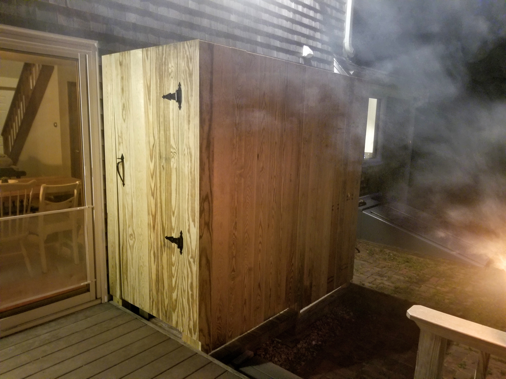

From small projects like floating shelves, built-ins, outdoor showers, or a raised bed for your vegetable garden, to larger home renovations and additions, we can help give your home that little something, or large something, you have been dreaming about.
Looking for a piece to show off for your home office or game room? We can build anything from custom poker tables to motorized standing desks.
Browse our gallery of past construction and finishing projects that Vince has worked on, and contact us with your needs. We look forward to working together to make your dream a reality.

<Row>
<Col>

Studio - Eastham

</Col>
<Col>

</Col>
</Row>

<Row>
<Col>

Outdoor Shower With a View - Welfleet

</Col>
<Col>

Outdoor Shower With a View - Welfleet

</Col>
<Col>

Roof Deck Stairs & Storage - Welfleet

</Col>
</Row>

<Row>
<Col>

Kitchen Remodel - Welfleet

</Col>
<Col>

Pantry Gliding Barn Door - Welfleet

</Col>
</Row>

<Row>
<Col>

Front Boardwalk Steps - Provincetown

</Col>
<Col>

60' Boardwalk - Provincetown

</Col>
<Col>

Rear Boardwalk Steps - Provincetown

</Col>
</Row>

<Row>
<Col>

Bar/Breakfast Nook - Welfleet

</Col>
<Col>

Finish Basement Renovation - Welfleet

</Col>
<Col>

Bathroom Remodel - Welfleet

</Col>
</Row>

<Row>
<Col>

Custom Mahogany Poker Table

</Col>
<Col>

Raised Garden Beds - Harwich

</Col>
<Col>

Custom Mahogany Poker Table

</Col>
</Row>
<Row>
<Col>

Entry Bench - Welfleet

</Col>
<Col>

Custom Valence - Welfleet

</Col>
</Row>
<Row>
<Col>

Rebuilt Mahogany Deck - Chatham

</Col>
<Col>

Clamshell Style Bulkhead Replacement - Orleans

</Col>
</Row>
<Row>
<Col>

New Outdoor Shower - Eastham

</Col>
<Col>

Deck Extention & Outdoor Shower - Orleans
</Col>
<Col>

Outdoor Shower Dividing Wall & Bench - Orleans

</Col>
</Row>
<Row>
<Col>

Kitchen Renovation - Harwich

</Col>
<Col>

Finished Basement - Harwich
</Col>
<Col>

Finished Basement - Harwich

</Col>
</Row>