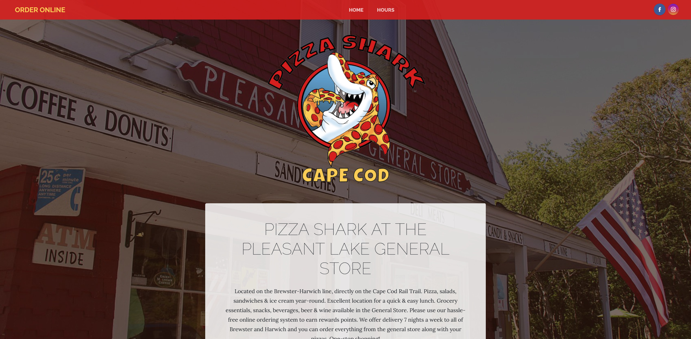
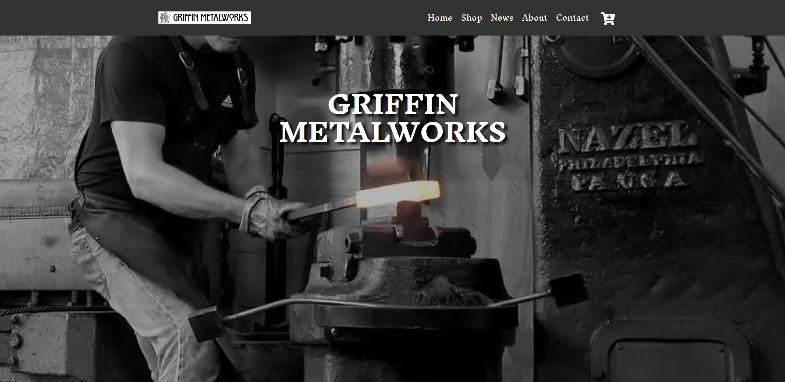
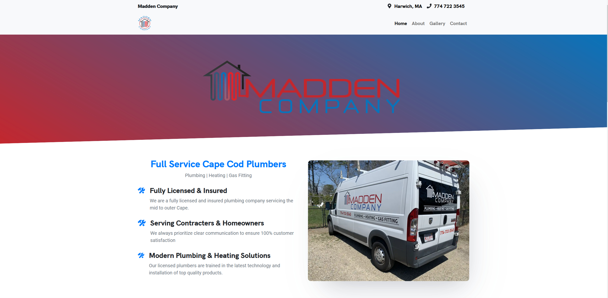
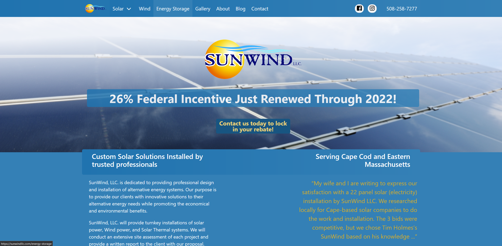

 
Built to Code creates first-class, custom-built websites that are clean, easy for visitors to use, and responsive to all devices. We employ a design process that ensures your site is built to convert and drive sales or leads. Our advanced e-commerce solutions let you accept payments securely whether you have hundreds or even thousands of products that you want to sell online, or you need an easy to use online ordering system for your restaurant.  
 
The best websites may require complex knowledge to build, but they’re easy to use and manage. We are happy to show you how to make any modifications you want to your site through a Content Management System. Or we can take care of your website content updates for you.  
 
  

[**Contact us with your ideas!**](/contact) 

   

## Past Projects:

<Row>
<Col>

[Pizza Shark](https://pleasantlakepizzashark.com/)
</Col>

<Col>

[Griffin Metalworks](https://griffinmetalworks.com/)
</Col>

</Row>

<Row>
<Col>

[Madden Company](https://maddencompany.biz/)
</Col>

<Col>

[Sunwind LLC](https://sunwindllc.com/)
</Col>

</Row>

 
 

## Services:

 
 

<Row>
<Col>

Start to Finish Web Design & Development
</Col>
<Col>

Fully Responsive Design
</Col>
<Col>

Content Management System Training

</Col>
</Row>

<Row>
<Col>

Web Hosting

</Col>
<Col>

On & Offsite SEO Implementation
</Col>

<Col>

Worry-free Ecommerce Security
</Col>

</Row>